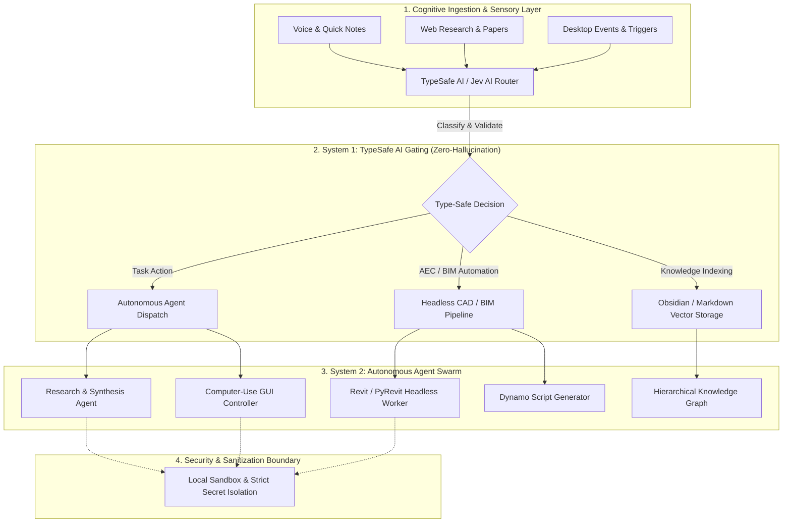

# 🧠 SecondBrain

> **Autonomous Multi-Agent Second Brain & Deterministic AEC Automation System**  
> Powered by Antigravity Agents, TypeSafe AI / Jev AI Deterministic Routing, and BIM Orchestration.

---

## 🌟 Executive Overview

**SecondBrain** is a next-generation personal operating system designed to bridge cognitive knowledge capture, autonomous multi-agent task execution, and deterministic CAD/BIM automation in Architecture, Engineering, and Construction (AEC).

Unlike conventional note-taking tools or open-ended LLM wrappers, **SecondBrain** implements a **two-tier cognitive architecture**:
1. **System 1 (Deterministic Fast Engine / Gating)**: Sub-second probabilistic classification, type-safe decision trees, and zero-hallucination workflow routing powered by **TypeSafe AI / Jev AI**.
2. **System 2 (Deep Reasoning & Multi-Agent Execution)**: Autonomous agent clusters that orchestrate long-horizon reasoning, computational geometry workflows, desktop computer-use, and parametric modeling.

---

## 🏗 Architecture Overview



---

## 🚀 Key Features

### 1. 🛡️ Deterministic Fast-Routing with TypeSafe AI
- **Sub-Second Gating**: Resolves ambiguous user intent into strictly typed schemas before dispatching heavy LLMs.
- **Zero Hallucination Routing**: Leverages high-assurance probabilistic models for categorical decisions (`Choice`, `Score`, `Noul`).
- **Dynamic Policy Enforcement**: Ensures autonomous desktop workflows execute only within predefined safety constraints.

### 2. 🏛️ AEC & BIM Autonomous Workflow Orchestration
- **Revit & PyRevit Automation**: Programmatic dispatch of BIM tasks (e.g., parameter extraction, automated sheet numbering, schedule generation).
- **Headless Execution**: Interacts with local AEC engines through isolated RPC hooks and computer-use automation.
- **Dynamo Graph Synthesis**: Converts natural language project requirements into parametric computational definitions.

### 3. 📚 Local-First, Privacy-Preserving Knowledge Graph
- **Zero Cloud Exposure**: Personal journals, strategic plans, and proprietary project data remain strictly local.
- **Markdown-Native**: Compatible with Obsidian, Logseq, and standard PKM formats.
- **Bi-Directional Cross-Linking**: Automatically maintains taxonomy and cross-domain synthesis.

---

## 🔒 Security & Privacy Guarantee

Security is a foundational pillar of this architecture:
- **Zero Credential Leakage**: API tokens, personal credentials, and secrets are strictly held in environment-isolated keychains (`.env` is never committed).
- **Local Boundary Isolation**: CAD/BIM models, proprietary design data, and personal notes are air-gapped from public repositories.
- **Input / Output Sanitization**: All outbound prompts undergo deterministic PII stripping before external API processing.

---

## 📂 Repository Structure

```text
SecondBrain/
├── .github/
│   └── workflows/          # CI/CD sanity checks and schema validation
├── config/                 # Sanitized configuration templates
│   └── settings.example.yaml
├── core/
│   ├── router/             # TypeSafe AI / Jev AI classification modules
│   ├── agents/             # Antigravity autonomous worker definitions
│   └── aec/                # BIM / Revit automation hooks
├── docs/                   # System design & architecture specifications
├── .env.example            # Environment template (NO secrets)
├── .gitignore              # Strict exclusion of sensitive/local data
├── LICENSE                 # Open-source MIT License
└── README.md               # Project documentation
```

---

## ⚡ Quickstart

### Prerequisites
- Python `>= 3.12`
- Git
- TypeSafe AI / Jev AI Developer Access

### Installation

```bash
# Clone the repository
git clone https://github.com/cryptoandforex21th-beep/SecondBrain.git
cd SecondBrain

# Create virtual environment
python -m venv .venv
source .venv/bin/activate  # On Windows: .venv\Scripts\activate

# Install dependencies
pip install -r requirements.txt

# Configure environment variables
cp .env.example .env
```

### Environment Configuration (`.env.example`)
```ini
# TypeSafe AI / Jev AI Configuration
TYPESAFE_AI_API_KEY=your_typesafe_key_here
TYPESAFE_AI_ENVIRONMENT=production

# Agent & Model Orchestration
AGENT_MODEL_PROVIDER=gemini
AGENT_TIMEOUT_SECONDS=300

# AEC Automation Hooks
REVIT_VERSION=2027
PYREVIT_CLI_PATH=C:\Program Files\pyRevit-CLI\pyrevit.exe
```

---

## 📄 License

Distributed under the **MIT License**. See [`LICENSE`](./LICENSE) for more information.
