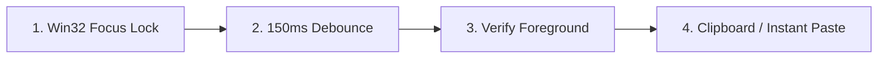

# Fast GUI Orchestrator (Anti-Latency & Focus-Shield Protocol)

This skill provides the definitive engineering protocol to eliminate the two most common bottlenecks in desktop GUI automation:
1. **Micro-Step Overkill**: Wasting 5–10 minutes on slow [Click → Screenshot → Model Think → Click] loops.
2. **Window Focus Stealing & Keystroke Racing**: Background windows, console prompts, or Antigravity stealing foreground focus, resulting in dropped characters (e.g. `C:` becoming `:\`) or misdirected hotkeys.

---

## ⚡ RULE 1: THE SPEED HIERARCHY (API > SCRIPT > BATCH > GUI)

Before touching a single mouse coordinate, always select the fastest viable tier:

| Tier | Method | Typical Latency | When to Use |
| :--- | :--- | :--- | :--- |
| **Tier 0** | **CLI / API / Direct Scripting** | `< 200 ms` | Git commands, file operations, process management, API queries. |
| **Tier 1** | **DOM / DevTools Protocol** | `< 500 ms` | Browser web pages, form filling, extracting web elements. |
| **Tier 2** | **Atomic GUI Batching (`cu batch`)** | `< 1 sec` | When GUI is mandatory. Chained sequential clicks, tabs, and inputs. |
| **Tier 3** | **Interactive Micro-Step** | `> 15 sec` | **STRICTLY FORBIDDEN** unless debugging an unexpected crash or error state. |

> [!IMPORTANT]
> **Zero Intermediate Screenshots Rule**:
> In deterministic workflows (e.g. fill input A → tab → fill input B → submit), **DO NOT take screenshots between steps**. Execute the entire sequence in one atomic batch, and only take a screenshot at the final milestone or if an error is caught.

---

## 🛡️ RULE 2: FOCUS-SHIELD & ANTI-RACE PROTOCOL (SOLVING POIN 2)

Whenever interacting with a target window, strictly follow the 4-phase Focus-Shield:



### 1. Win32 Explicit Focus Lock
Always activate the target window explicitly by Handle before sending any keystroke or click:
```powershell
& "C:\Users\Heru Ardiansyah\.gemini\config\skills\computer-use\bin\cu.exe" focus -Handle $TargetHandle
```

### 2. Message Queue Debounce (150 ms)
Windows message loops require a brief window to flush focus events. Always sleep 150 ms after a focus switch before injecting the first character:
```powershell
Start-Sleep -Milliseconds 150
```

### 3. Clipboard & Paste Over Character-by-Character Typing
* **Problem**: Typing long strings (paths, URLs, complex text) character-by-character is vulnerable to focus shifts mid-typing, causing truncated strings (like `:\Users` instead of `C:\Users`).
* **Solution**: For paths, URLs, and large text, **ALWAYS push to clipboard and paste atomically**:
```powershell
Set-Clipboard -Value "C:\Target\Path\Here"
& "C:\Users\Heru Ardiansyah\.gemini\config\skills\computer-use\bin\cu.exe" hotkey -Keys "Ctrl,V"
# Or universal Win32 paste:
& "C:\Users\Heru Ardiansyah\.gemini\config\skills\computer-use\bin\cu.exe" hotkey -Keys "Shift,Insert"
```

### 4. Background Command Isolation
Never launch subprocesses or background tasks that create interactive console windows while a target GUI window is accepting input. Run all commands with `-NoProfile -WindowStyle Hidden` or headless flags.

---

## 🚀 RULE 3: ATOMIC PIPELINING VIA `cu batch`

Combine multi-step interactions into a single JSON batch call. A 5-step form fill that previously took 2 minutes now completes in 300 milliseconds:

```powershell
& "C:\Users\Heru Ardiansyah\.gemini\config\skills\computer-use\bin\cu.exe" batch -Batch '[
  {"action":"focus","handle":66844},
  {"action":"click","x":520,"y":310},
  {"action":"type","text":"SecondBrain"},
  {"action":"click","x":520,"y":420},
  {"action":"type","text":"Deterministic AEC System"},
  {"action":"click","x":1255,"y":880}
]'
```

---

## 📋 Pre-Flight Checklist Before Running Desktop GUI

- [ ] Can this be done via PowerShell, Git, or API instead of GUI? (If yes, abort GUI).
- [ ] Has the target window handle been resolved and focused?
- [ ] Is long text being injected via clipboard paste rather than keystroke typing?
- [ ] Are intermediate screenshots disabled for standard sequential steps?
- [ ] Is cleanup (`cu session-stop`) called immediately once the workflow is completed?
